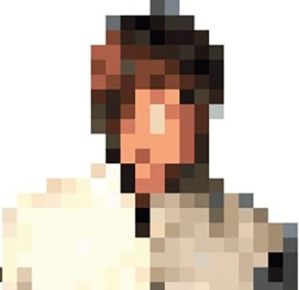
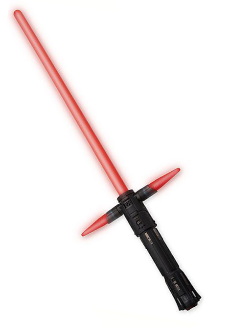
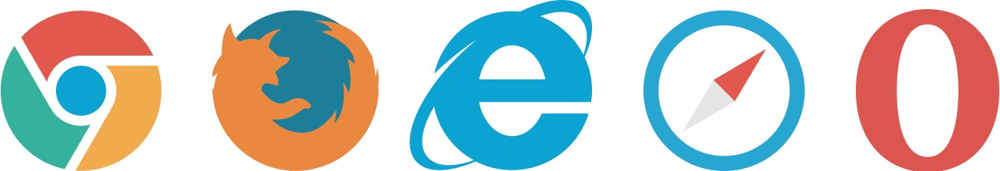
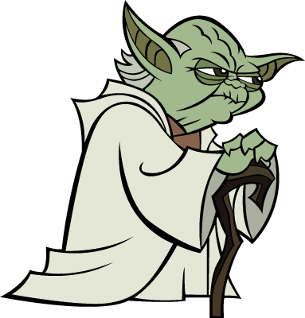
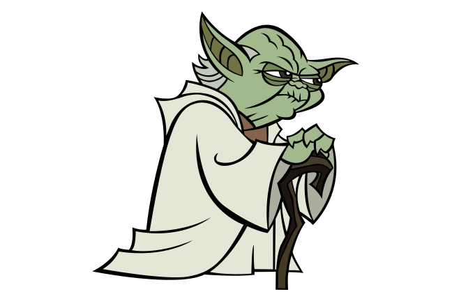
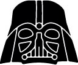
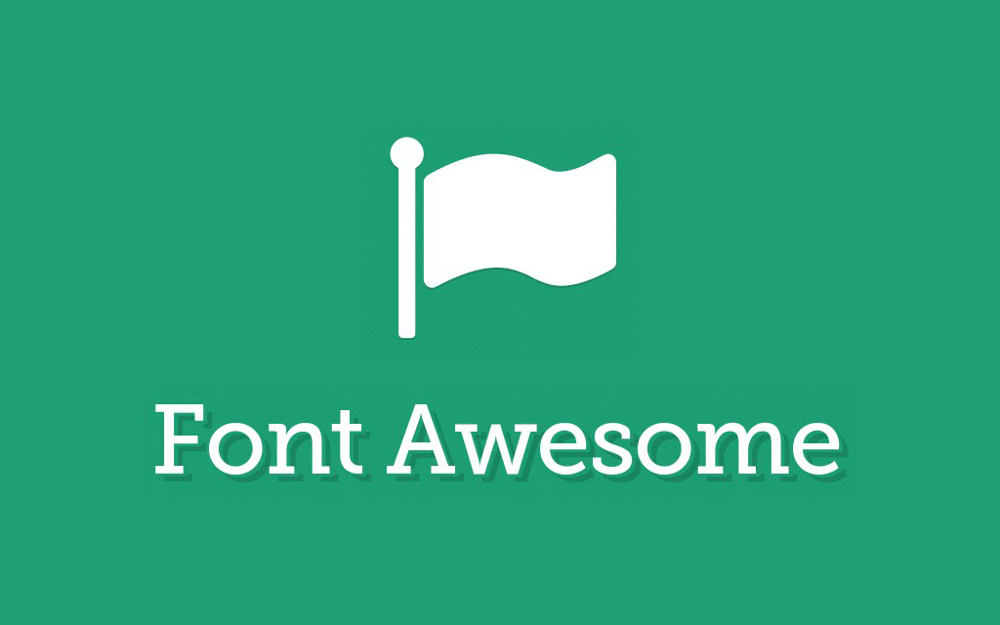
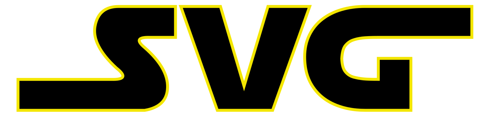

# SVG.   Welcome to the Vector Side! {#Cover}

*Brought to you by [Alexey Alexeyev](https://github.com/NE05KY/) and generated by [Jekyller](https://github.com/shower/jekyller)*

{:.vader}
<!-- Copyright 2012 KrOprOX -->
{:.luke}

<footer>
Всем привет! Сейчас будет небольшой обзорный доклад про использование векторной графики в вебе и конкретно про SVG-графику. 
Но для начала хотел бы спросить, кто из вас уже использует SVG в своих проектах? 
Окей, к вам вопросов нет, а что с остальными? 
Давайте мы сейчас с вами побеседуем, и, может быть, вы тоже присоединитесь к векторной стороне. 
Поехали!
</footer>

## Алексей Алексеев {#AboutMe}

{:.avatar}

{:.iam}
Front-end Developer at Exadel

{:.twi}
{:.twitter} @NE05KY

<footer>
Для начала представлюсь, меня зовут Алексеев Алексей и я работаю фронт-енд разработчиком в компании Exadel.
</footer>

## **SVG**

<footer>
Давайте разбираться, что же такое SVG?
</footer>

## SVG*

- Язык разметки векторной графики
- XML-подобный синтаксис
- Разрабатывается W3C с 1999 года
- Версия 1.0 в 2001 году
- ...Версия 1.1 в 2011 году

{:.note}
*Scalable Vector Graphics.

<footer>
Это язык разметки масштабируемой векторной графики который входит подмножество XML.
Первые черновики языка были созданы веб-консорциумом в 1999 году.
Версия 1.0 вышла спустя 2 года, в 2001.
Язык получил очень бурное развитие и спустя 10 лет вышла версия 1.1, которая актуальна по сей день.
</footer>

## Преимущества {#Pros}

{:.saber}

- Векторный
- ...Масштабируемый
- ...Текстовый
- ...Навороченный
- ...Похож на HTML & CSS

<footer>
Чем же так хорош этот формат? 
1. Во первых он векторный. 
Т.е. изображение описывается набором графических примитивов.
2. Во вторых он масштабируемый, т.е. на каких бы экранах мы не открывали изображение, оно будет выглядеть одинаково четко.
3. Это текстовый формат, и самые смелые рисуют векторную графику прямо в блокноте. 
Но на самом деле это означает, что изменение цвета или контура объекта на изображении сильно упрощается, по сравнению с растровой графикой.
И все такие изменения отлично отслеживаются любой системой контроля версий.
4. Под капотом у SVG много технических фишек, которые расширяют его возможности, такие как дублирование объектов, создание паттернов, фильтров, масок, анимаций и всякого остального.
5. Синтаксис языка схож с обычным html, а внутри разметки можно писать обычные css-стили.
</footer>

## Поддержка браузерами {#Crossbrowser}
<!-- TODO: tooltips -->
{:.browsers}
IE9+
<!-- Copyright caferati.me @ rafael@caferati.me -->

<footer>
Ну и так как это довольно взрослый формат, он отлично поддерживается всеми браузерами.
И даже ИЕ начиная с 9-ой версии. 
Так же поддерживается мобильными браузерами, андроидом с версии 2.3.
</footer>

## Для чего использовать?

1. Элементы UI
2. ...Логотипы
3. ...Иконки
4. ...Векторных иллюстраций
5. ...Графики
6. ...Карты
7. ...Градиенты 

<footer>
Но векторная графика это не серебрянная пуля и подходит не для все ситуаций.
Не получится заменить всю растровую графику векторной. SVG покрывает свой строго определенный спектр задач.

Несмотря на все преимущества SVG-графики, это не лучший выбор для любой ситуации.
<!-- TODO: Дописать описание -->
</footer>

## **Изображения**

## Изображения {#Pictures}

| PNG (36Kb)                   | SVG (10Kb)             | 
+------------------------------|------------------------+
|        |  |

## Элементы - DOM

## Анимация {#Croco}

<svg version="1.1" id="crocodile" xmlns="http://www.w3.org/2000/svg" xmlns:xlink="http://www.w3.org/1999/xlink" x="0px" y="0px" width="700px" height="500px" viewBox="0 0 400 250" enable-background="new 0 0 260 250" xml:space="preserve"> <g> <text id="symbol" transform="matrix(1 0 0 1 224.2318 361)" fill="#848383" font-family="'MyriadPro-Regular'" font-size="70">SVG!</text> <g id="head"> <polygon fill="#09B39C" points="44.613,146.703 26.665,140.721 8.718,146.703 -0.252,146.703 -0.252,206.523 44.613,206.523 119.387,206.523 119.387,167.64 "></polygon> <polygon opacity="0.2" fill="#FFFFFF" enable-background="new " points="-0.252,146.703 11.712,170.631 26.667,140.721 8.721,146.703 "></polygon> <polyline opacity="0.2" fill="#FFFFFF" enable-background="new " points="8.718,146.703 20.685,152.685 26.665,140.721 "></polyline> <polygon opacity="0.2" fill="#FFFFFF" enable-background="new " points="44.613,146.703 53.613,163.667 17.694,143.712 26.667,140.721 "></polygon> </g> <g id="upper-head" transform="matrix(0.9903,0.1392,-0.1392,0.9903,20.8867,-4.693)"> <g id="upper-jaw" transform="matrix(0.7986,0.6018,-0.6018,0.7986,94.3542,-29.9951)"> <g> <path id="upper-teeth" fill="#E0CAB1" d="M151.174,129.382l14.913,6.086l-6.602-14.691L151.174,129.382z M138.707,142.292 l14.914,6.086l-6.603-14.692L138.707,142.292z M126.241,155.201l14.913,6.086l-6.602-14.692L126.241,155.201z M163.64,116.474 l14.913,6.085l-6.603-14.692L163.64,116.474z M176.106,103.564l14.913,6.086l-6.602-14.692L176.106,103.564z M188.572,90.655 l14.914,6.085l-6.602-14.691L188.572,90.655z M201.039,77.746l14.913,6.085L209.35,69.14L201.039,77.746z M221.816,56.23 l-8.311,8.607l14.913,6.085L221.816,56.23z"></path> <path opacity="0.4" fill="#FFFFFF" enable-background="new " d="M155.329,125.08l10.758,10.388l-6.602-14.691L155.329,125.08 z M142.863,137.989l10.758,10.389l-6.603-14.692L142.863,137.989z M130.396,150.898l10.758,10.389l-6.602-14.692 L130.396,150.898z M167.796,112.171l10.757,10.388l-6.603-14.692L167.796,112.171z M180.261,99.261l10.758,10.389l-6.602-14.692 L180.261,99.261z M192.728,86.352l10.758,10.388l-6.602-14.691L192.728,86.352z M205.195,73.443l10.757,10.388L209.35,69.14 L205.195,73.443z M221.816,56.23l-4.156,4.303l10.758,10.389L221.816,56.23z"></path> </g> <polygon fill="#09B39C" points="215.135,33 200.18,33 197.189,46.955 92,125 88.355,171.706 106.387,180.64 236.072,47.955 "></polygon> <polygon opacity="0.2" fill="#FFFFFF" enable-background="new " points="92,125 97.423,150.703 197.189,46.955 "></polygon> <line opacity="0.2" fill="#FFFFFF" enable-background="new " x1="197.189" y1="46.955" x2="92" y2="125"></line> <polygon opacity="0.2" fill="#FFFFFF" enable-background="new " points="200.18,33 236.072,47.955 215.135,33 "></polygon> <polygon opacity="0.2" fill="#FFFFFF" enable-background="new " points="197.189,46.955 215.135,33 200.18,33 "></polygon> </g> <polygon fill="#09B39C" points="92,125 65.55,126.757 44.613,146.703 44.613,176.523 119.387,176.523 119.387,167.64 107.897,156.377 "></polygon> <polygon opacity="0.2" fill="#FFFFFF" enable-background="new " points="92,125 102.423,145.703 65.55,126.757 "></polygon> <polygon opacity="0.2" fill="#FFFFFF" enable-background="new " points="44.613,146.703 102.423,145.703 92,125 65.55,126.757 "></polygon> <polygon id="eye_1_" fill="#FFFFFF" points="71.532,145.703 83.495,139.721 95.459,145.703 80.505,154.676 "></polygon> <polygon opacity="0.2" fill="#FFFFFF" enable-background="new " points="44.613,146.703 44.613,158.667 92,125 65.55,126.757 "></polygon> </g> <g id="bottom-jaw"> <g> <polygon fill="#E0CAB1" points="152.531,185.586 158.513,170.631 164.495,185.586 "></polygon> <polygon opacity="0.4" fill="#FFFFFF" enable-background="new " points="164.495,185.586 158.513,170.631 158.513,185.586 "></polygon> </g> <g> <polygon fill="#E0CAB1" points="170.477,185.586 176.459,170.631 182.441,185.586 "></polygon> <polygon opacity="0.4" fill="#FFFFFF" enable-background="new " points="182.441,185.586 176.459,170.631 176.459,185.586 "></polygon> </g> <g> <polygon fill="#E0CAB1" points="188.423,185.586 194.405,170.631 200.387,185.586 "></polygon> <polygon opacity="0.4" fill="#FFFFFF" enable-background="new " points="200.387,185.586 194.405,170.631 194.405,185.586 "></polygon> </g> <g> <polygon fill="#E0CAB1" points="206.369,185.586 212.351,170.631 218.333,185.586 "></polygon> <polygon opacity="0.4" fill="#FFFFFF" enable-background="new " points="218.333,185.586 212.351,170.631 212.351,185.586 "></polygon> </g> <g> <polygon fill="#E0CAB1" points="224.315,185.586 230.297,170.631 236.279,185.586 "></polygon> <polygon opacity="0.4" fill="#FFFFFF" enable-background="new " points="236.279,185.586 230.297,170.631 230.297,185.586 "></polygon> </g> <polygon fill="#E0CAB1" points="148.54,179.604 119.596,167.64 109.657,167.64 103.675,167.64 91.711,167.64 79.747,179.604 0,200.541 0,206.523 79.747,206.523 156.522,206.523 187.432,198.55 235.288,189.577 244.252,179.604 "></polygon> <polygon opacity="0.3" fill="#FFFFFF" enable-background="new " points="119.594,167.64 91.711,167.64 79.747,179.604 "></polygon> <polygon opacity="0.3" fill="#FFFFFF" enable-background="new " points="91.711,167.64 79.747,206.523 79.747,179.604 "></polygon> <polygon opacity="0.1" fill="#534741" enable-background="new " points="235.288,189.577 160.513,195.559 115.639,206.523 156.522,206.523 187.432,198.55 "></polygon> <polygon opacity="0.1" fill="#534741" enable-background="new " points="187.432,198.55 160.513,195.559 156.522,206.523 156.522,206.523 "></polygon> <polygon opacity="0.3" fill="#FFFFFF" enable-background="new " points="0,200.541 46.847,194.559 79.747,179.604 "></polygon> </g> </g> <desc>Created with Snap</desc><defs></defs></svg>

<!-- svg from site snapsvg.io -->

## **Иконки**  

<footer>
Иконки это то, для чего SVG подходит просто идеально. 
Небольшие изображение с маленьким количеством деталей в векторе будут весить несколько раз меньше и выглядеть заметно четче.
Вам не придётся подсовывать картинки в двухкратном разрешении для дисплеев с высокой плотностью пикселей. 
</footer>

## Иконки {#VaderIcon}

| PNG (12Kb)                   | SVG (6Kb)                    | 
+------------------------------|------------------------------+
|  |  |

<footer>
К примеру, Дарт Вейдер в векторе выглядит намного лучше, да и весит в 2 раза меньше.
Но это всего лишь одна иконка, если у вас их сотни - SVG может сэкономить несколько секунд на первой загрузке страницы,
до того как они попадут в кеш. 
</footer>

## Icons 
{:.cover #Icons}

<link rel="stylesheet" type="text/css" href="scripts/font-awesome.min.css">

<footer>
Однако, мало кто использует одну-две иконки в проекте.
В большинстве случаев их количество стремится к сотне.
Но чем больше становится иконок, тем сложнее ими управлять. 
И в этом месте нас встречают 2 популярные техники: это спрайты и шрифтовые иконки.
</footer>

## Спрайты
- Объединение всех изображений в одно
- Манипулирование background-position
- Сокращают количество запросов к серверу
- Безболезненная техника при использовании автоматизации

<footer>
Техника спрайтов подразумевает под собой склеивание всех иконок в один большой файл, 
и путем манипулирования css-свойством background-position отображения определённой части картинки в нужном блоке.
Это позволяет сократить количество http-запросов к серверу, и тем самым ускорить загрузку страниц.
Как правило, никто не склеивает спрайты руками.
Утилиты автоматизации получая на входе папку с изображениями, на выходе предоставляют склеенный спрайт и css-файл
с набором классов для иконок.
</footer>

## Иконочный шрифт
- Модная техника
- Символ шрифта - иконка
- Символы юникода (E000-F8FF)

<footer>
Техника иконочных шрифтов более свежая, однако уже набравшая популярность среди разработчиков.
Заключается она в том, что иконки упаковываются в обычный шрифтовой файл, где им назначаются спецсимволы юникода,
обычно из диапазона E000-F8FF (Область частного использования).
После этого, их можно использовать на странице 
</footer>

## Пример использования {#FontExample}
    <i class="<mark>ico ico-r2d2</mark>"></i>
    <i><mark>&#xf0ab;</mark></i>

{:.r2d2}

## Font Awesome
{:.cover #FA}

<footer>
Самый простой вариант, который, я уверен, многие из вас используют - воспользоваться готовым набором иконок, 
например таким, как  Font Awesome. 
</footer>

## Кастомный шрифт

- Бесплатный сервис <a href="https://icomoon.io">IcoMoon.io</a>
- Коллекция из 4000+ иконок
- Импорт собственных SVG
- Форматы ttf, eot, svg и woff+

<footer>
Но что делать, если необходимо добавить в набор новую иконку?
Или если вам в проекте не нужно 600 иконок?
В таком случае вы можете сами создать свой собственный иконочный шрифт.
Благо инструментов для этого хватает.
Самый популярный из них - сервис IcoMoon.
Данный сервис позволяет создать свой набор из коллекции 4000+ иконок,
или импортировать собственную графику. 
После генерации на выходе вы получите шрифт в 4-ех различных форматах и css-файл с подключением шрифта.
</footer>

## Что не успел рассказать
- SVGO
- Responsive SVG
- Анимации

## Final 
{:.cover #Final}

<link rel="stylesheet" type="text/css" href="scripts/final.css">

    <!-- TODO: fix animation -->
    
    Welcome to the Vector Side!

