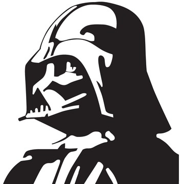

---

layout: ribbon

style: |

    #Cover {
        background: #FFF;
    }
    #Cover .vader {
        right: 0;
        left: auto;
        bottom: 0;
        top: auto;
    }
    #Cover .luke {
        left: 0;
        bottom: 0;
        top: auto;
        }
    #Cover h2 {
        margin:-30px 0 0;
        color:#666;
        text-align:center;
        font-size:70px;
        }
    #Cover p {
        margin:10px 0 0;
        text-align:center;
        font-style:italic;
        font-size:20px;
        }
        #Cover p a {
            color: grey;
            }
            
            
            
    #Picture h2 {
        color:#FFF;
        }
    #SeeMore h2 {
        font-size:100px
        }
    #SeeMore img {
        width:0.72em;
        height:0.72em;
        }
---

# SVG.   Welcome to the Vector Side! {#Cover}

*Brought you by [Alexey Alexeyev](https://github.com/NE05KY/) and generated by [Jekyller](https://github.com/shower/jekyller)*

{:.vader}
<!-- Copyright 2012 KrOprOX -->
{:.luke}

## Алексей Алексеев {#AboutMe}

{:.avatar}

{:.iam}
Front-end Developer at Exadel

{:.twi}
{:.twitter} @NE05KY

## **SVG**

## SVG

1. XML-подобный формат
2. Разрабатывается с 1999 года
3. 

{:.note}
Scalable Vector Graphics.

## Что внутри?

1. Примитивы
2. Use
3. Фильтры
4. Анимации
5. Паттерны?

## Plain Text on Your Slides

Lorem ipsum dolor sit amet, consectetur [adipisicing](#all-kind-of-lists) elit, sed do eiusmod tempor incididunt ut labore et dolore magna aliqua. Ut enim ad minim veniam, *quis nostrud* exercitation ullamco laboris **nisi ut aliquip** ex ea commodo consequat. Duis aute irure <i>dolor</i> in reprehenderit in voluptate velit esse cillum <b>dolore</b> eu fugiat nulla pariatur. Excepteur sint occaecat cupidatat non proident, sunt in `<culpa>` qui officia deserunt mollit anim id est laborum.

## All Kind of Lists

1. Simple lists are marked with bullets
2. Ordered lists begin with a number
3. You can even nest lists one inside another
    - Or mix their types
    - But do not go too far
    - Otherwise audience will be bored
4. Look, seven rows exactly!

## Serious Citations

<figure markdown="1">

> Lorem ipsum dolor sit amet, consectetur adipisicing elit, sed do eiusmod tempor incididunt ut labore et dolore magna aliqua. Ut enim ad minim veniam, quis nostrud exercitation ullamco laboris nisi ut aliquip ex ea commodo consequat. Duis aute irure dolor in reprehenderit in voluptate velit esse cillum dolore eu fugiat nulla pariatur. Excepteur sint occaecat cupidatat non proident, sunt in culpa qui officia.

<figcaption>Marcus Tullius Cicero</figcaption>
</figure>

## Code Samples

    <!DOCTYPE html>
    <html lang="en">
    <mark><head></mark> <mark class="comment"><!--Comment--></mark>
        <title>Shower</title>
        <meta charset="<mark class="important">UTF-8</mark>">
        <link rel="stylesheet" href="screen.css">
    <mark></head></mark>

## Even Tables

|  Locavore      | Umami       | Helvetica | Vegan     |
+----------------|-------------|-----------|-----------+
|* Fingerstache *| Kale        | Chips     | Keytar    |
|* Sriracha     *| Gluten-free | Ennui     | Keffiyeh  |
|* Thundercats  *| Jean        | Shorts    | Biodiesel |
|* Terry        *| Richardson  | Swag      | Blog      |

It’s good to have information organized.

## Pictures
{:.cover #Picture}

<!-- photo by John Carey, fiftyfootshadows.net -->

## **You can even shout this way**

## Inner Navigation

1. Lets you reveal list items one by one
2. …To keep some key points
3. …In secret from audience
4. …But it will work only once
5. …Nobody wants to see the same joke twice

##  [See more on GitHub](https://github.com/shower/shower/)
{:.shout #SeeMore}
